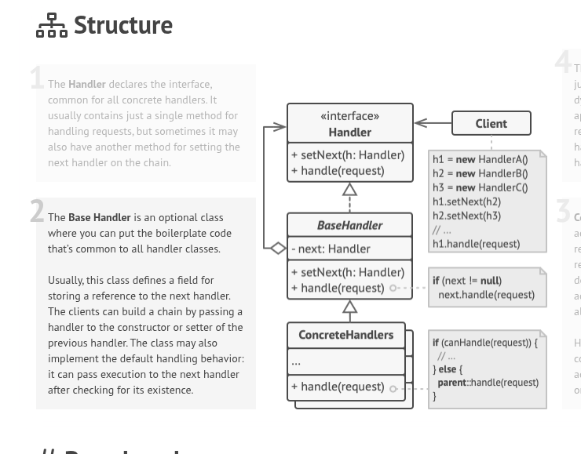

# Web server.
Creating web server on c++ language.
This task aim to learn HTTP protocol on low level, using socket and epoll function to handle connection.

## What I need to implement

Sort of midleware to get static files.
Do i need to handle REST API???
Can i make some structure of sort of framework??


## What I would like to see:

### Simple setup of server
```cpp
// handles /static/*, /favicon ico, /index.html
auto app = HttpAppBuilder{}
  .useStaticFiles("./www")
  .get("/api/health", [](auto& req){ return text("ok"); })
  .build();

HttpServer server = HttpServerBuilder{}
  .listen("0.0.0.0", 8080)
  .withApp(std::move(app))
  .build();

// epoll loop
server.run(); 
```

### Simple structer

- Net layer (no HTTP knowledge): accept sockets, epoll loop, per-connection read/write buffering
	- HttpServer (listen/epoll)
	- Connection (fd, inBuffer, outBuffer, state, i need keep connection till i will get \r\n\r\n sequence at the end of HTML)
- HTTP layer (pure parsing/formatting):
	- HttpRequest (method, target/path, headers, body)
	- HttpResponse (status, headers, body)
	- HttpParser (incremental: parse when \r\n\r\n is present; later add body support)
	- ResponseWriter (serialize headers + body bytes)
- App layer (your “framework”):
	- HttpApp: class for framework
	- Middleware: bool handle(const HttpRequest&, HttpResponse& out) (returns handled or not)
	- RouterMiddleware: exact match method+path -> handler
	- StaticFilesMiddleware(docRoot): serves /favicon.ico, /static/..., /app.js, etc
	- NotFoundMiddleware

#### SMall about middleware
I want to try to implement this design pattern

